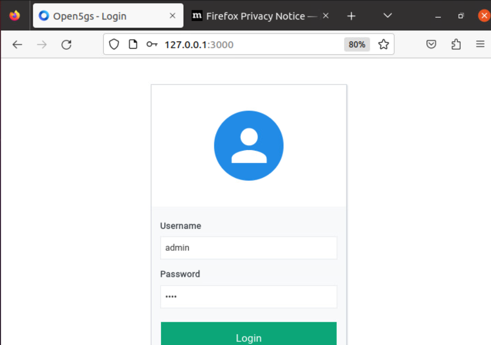
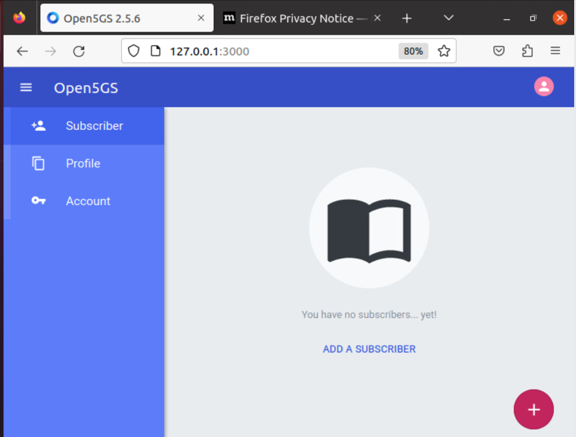

# 5G setup 

## Setup OS required: 

* Ubuntu 20.04

This project utilizes two open source projects for the 5G network simulation: 

* 5G core: [Open5GS](https://open5gs.org/)
* UE and RAN: [UERANSIM](https://github.com/aligungr/UERANSIM)

In this repo, there are two ways to deploy this. 

* Install it manually with the provided commands
* Import the provided VMs in virt-manager 


There are several hypervisors available. However, we prefer to use virt-manager since offers the capabilities of making the VM to use a specific intetface, and it can be used with ubuntu 20.04 


## Install and Setup Open5Gs 

For this approach, we prefer to setup different componets of the simulation in separate VMs: 

* VM1 for the Control Plane (CP)
* VM2 for the User Plane (UP)
* VM3 for the gNB 
* VM4 for the UE 


### VM1: Control Plane Setup 

#### Create VM in virt-manager 

* Open virt-manager 

```bash 
sudo virt-manager 
```

* Select *Create a new virtual machine*

<p align="center">
    
</p>


* Select the following options 

<p align="center">
  
</p>


<p align="center">
  
</p>

<p align="center">
  
</p>


<p align="center">
  
</p>


<p align="center">
  
</p>


### Access the machine through SSH 

* Install ssh 

```bash
sudo apt install openssh-server -y && sudo apt update && sudo apt upgrade -y 
```

* In the ubuntu host, open a terminal and access the VM through SSH. Use the corresponding IP 

```bash
ssh cp@192.168.100.154
```


# Open5GS - CP 

## Getting MongoDB

* Import the public key used by the package management system.

```bash
sudo apt update
sudo apt install wget gnupg -y
wget -qO - https://www.mongodb.org/static/pgp/server-6.0.asc | sudo apt-key add -

```

* Create the list file /etc/apt/sources.list.d/mongodb-org-6.0.list for your version of Ubuntu.

```bash
echo "deb [ arch=amd64,arm64 ] https://repo.mongodb.org/apt/ubuntu focal/mongodb-org/6.0 multiverse" | sudo tee /etc/apt/sources.list.d/mongodb-org-6.0.list

```

* Install the MongoDB packages.

```bash
sudo apt update 
sudo apt install -y mongodb-org
sudo systemctl start mongod
sudo systemctl enable mongod
```


## Getting Open5GS

* Ubuntu makes it easy to install Open5GS as shown below.

```bash 
sudo add-apt-repository ppa:open5gs/latest
sudo apt update
sudo apt install open5gs -y
```


## Building the WebUI of Open5GS

The WebUI allows you to interactively edit subscriber data. While it is not essential to use this, it makes things easier when you are just starting out on your Open5GS adventure. (A command line tool is available for advanced users).

Node.js is required to install the WebUI of Open5GS

Debian and Ubuntu based Linux distributions can install Node.js as follows:

```bash
sudo apt install curl -y
curl -fsSL https://deb.nodesource.com/setup_18.x | sudo -E bash -
sudo apt install nodejs
```

* You can now install WebUI of Open5GS.

```bash
curl -fsSL https://open5gs.org/open5gs/assets/webui/install | sudo -E bash -
```


## Register Subscriber Information

Connect to http://127.0.0.1:3000 and login with admin account.

Username : admin
Password : 1423

You can change the password after login 

<p align="center">
  
</p>


<p align="center">
  
</p>


<p align="center">
  
</p>

<p align="center">
  
</p>


<p align="center">
  
</p>


### Add more UEs

For this approach, we are adding up to 100 UEs. There is a python script that will allow you to add these 100 UEs in an automated way. They have a static IP address, feel free to modify any parameters. 


* Add the subscriber 

```bash
nano addSuscriber.py
```

* Copy and paste the code below 

```code 
from pymongo import MongoClient
from bson.int64 import Int64

# Create a new MongoClient
client = MongoClient('mongodb://localhost:27017/')

# Connect to the 'open5gs' database
db = client['open5gs']

# Generate and insert subscribers with IMSI and UE IP addresses from 2 to 101
for i in range(2, 102):
    imsi = f'001010000000{i:03d}'
    ue_ip = f'10.45.0.{i}'

    new_subscriber = {
        'imsi': imsi,
        'msisdn': [],
        'imeisv': '4301816125816152',
        'mme_host': [],
        'mme_realm': [],
        'purge_flag': [],
        'security': {
            'k': '465B5CE8 B199B49F AA5F0A2E E238A6BC',
            'op': None,
            'opc': 'E8ED289D EBA952E4 283B54E8 8E6183CA',
            'amf': '8000',
            'sqn': Int64(513)
        },
        'ambr': { 'downlink': { 'value': 1, 'unit': 3 }, 'uplink': { 'value': 1, 'unit': 3 } },
        'slice': [
            {
                'sst': 1,
                'default_indicator': True,
                'session': [
                    {
                        'name': 'internet',
                        'type': 3,
                        'qos': {
                            'index': 9,
                            'arp': {
                                'priority_level': 8,
                                'pre_emption_capability': 1,
                                'pre_emption_vulnerability': 1
                            }
                        },
                        'ambr': {
                            'downlink': { 'value': 1, 'unit': 3 },
                            'uplink': { 'value': 1, 'unit': 3 }
                        },
                        'ue': { 'addr': ue_ip },
                        'pcc_rule': []
                    }
                ]
            }
        ],
        'access_restriction_data': 32,
        'subscriber_status': 0,
        'network_access_mode': 0,
        'subscribed_rau_tau_timer': 12
    }

    # Insert the new subscriber into the 'subscribers' collection
    db.subscribers.insert_one(new_subscriber)


```


* Install dependencies 

```bash 
sudo apt install python3-pip -y && sudo pip3 install pymongo
```

* Run script 

```bash
sudo python3 addSubscriber.py
```


## Verify mongodb 

```bash
mongosh 
```

```bash
use open5gs 
```

```bash
db.subscribers.find({})
```

<p align="center">
  
</p>


### VM2: User Plane Setup 

#### Create VM in virt-manager 

* Open virt-manager 

```bash 
sudo virt-manager 
```

* Select *Create a new virtual machine*

<p align="center">
    
</p>


* Select the following options 

<p align="center">
  
</p>


<p align="center">
  
</p>

<p align="center">
  
</p>


<p align="center">
  
</p>


<p align="center">
  
</p>


### Access the machine through SSH 

* Install ssh 

```bash
sudo apt install openssh-server -y && sudo apt update && sudo apt upgrade -y 
```

* In the ubuntu host, open a terminal and access the VM through SSH. Use the corresponding IP 

```bash
ssh up@192.168.100.194
```


# Open5GS - UP 


```bash
sudo apt update && sudo apt upgrade -y 
```

**Remember to make a snapshot**


## Getting Open5GS

* Ubuntu makes it easy to install Open5GS as shown below.

```bash 
sudo add-apt-repository ppa:open5gs/latest
sudo apt update
sudo apt install open5gs -y
```


* Allow UE network traffic to access the internet. 

```bash
sudo sysctl -w net.ipv4.ip_forward=1
sudo iptables -t nat -A POSTROUTING -s 10.45.0.0/16 ! -o ogstun -j MASQUERADE
```


* Create a script to run this at reboot since this is non-persistent 

```bash
nano upf.sh
```

* Copy content 

```bash
#!/bin/bash

sudo sysctl -w net.ipv4.ip_forward=1
sudo iptables -t nat -A POSTROUTING -s 10.45.0.0/16 ! -o ogstun -j MASQUERADE
```


```bash
sudo crontab -e 
```

* Add this line to the end 

```bash
@reboot /bin/bash /home/up/upf.sh
```


### VM3: gNB Setup 

#### Create VM in virt-manager 

* Open virt-manager 

```bash 
sudo virt-manager 
```

* Select *Create a new virtual machine*

<p align="center">
    
</p>


* Select the following options 

<p align="center">
  
</p>


<p align="center">
  
</p>

<p align="center">
  
</p>


<p align="center">
  
</p>


<p align="center">
  
</p>


### Access the machine through SSH 

* Install ssh 

```bash
sudo apt install openssh-server -y && sudo apt update && sudo apt upgrade -y 
```

* In the ubuntu host, open a terminal and access the VM through SSH. Use the corresponding IP 

```bash
ssh gnb@192.168.100.209
```


# UERANSIM - gNB

## Getting the UERANSIM

```bash
sudo apt update && sudo apt upgrade -y && sudo apt install git -y
```

* Clone repo 

```bash 
cd ~
git clone https://github.com/aligungr/UERANSIM
cd UERANSIM
```

* Install the required dependencies 

```bash 
sudo apt install make && sudo apt install gcc -y && sudo apt install g++ && sudo apt install libsctp-dev lksctp-tools -y && sudo apt install iproute2 && sudo snap install cmake --classic
```

## Build UERANSIM

```bash 
cd ~/UERANSIM
make
```


### VM4: UE Setup 

#### Create VM in virt-manager 

* Open virt-manager 

```bash 
sudo virt-manager 
```

* Select *Create a new virtual machine*

<p align="center">
    
</p>


* Select the following options 

<p align="center">
  
</p>


<p align="center">
  
</p>

<p align="center">
  
</p>


<p align="center">
  
</p>


<p align="center">
  
</p>


### Access the machine through SSH 

* Install ssh 

```bash
sudo apt install openssh-server -y && sudo apt update && sudo apt upgrade -y 
```

* In the ubuntu host, open a terminal and access the VM through SSH. Use the corresponding IP 

```bash
ssh ue@192.168.100.192
```


# UERANSIM - UE

## Getting the UERANSIM

```bash
sudo apt update && sudo apt upgrade -y && sudo apt install git -y
```

* Clone repo 

```bash 
cd ~
git clone https://github.com/aligungr/UERANSIM
cd UERANSIM
```

* Install the required dependencies 

```bash 
sudo apt install make && sudo apt install gcc -y && sudo apt install g++ && sudo apt install libsctp-dev lksctp-tools -y && sudo apt install iproute2 && sudo snap install cmake --classic
```

## Build UERANSIM

```bash 
cd ~/UERANSIM
make
```